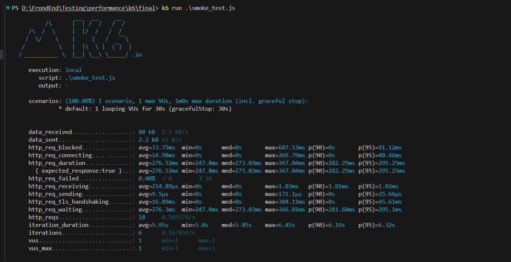
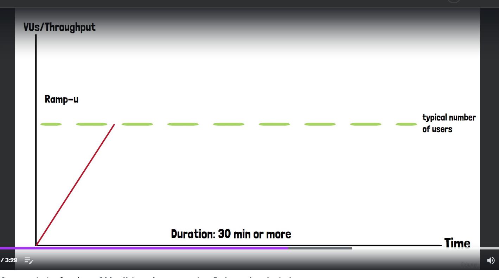
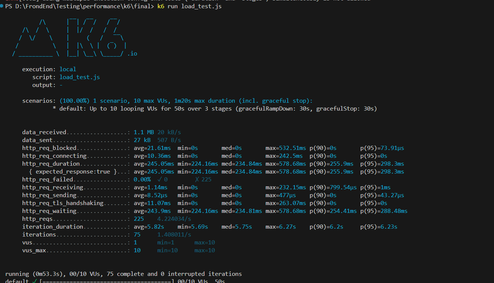
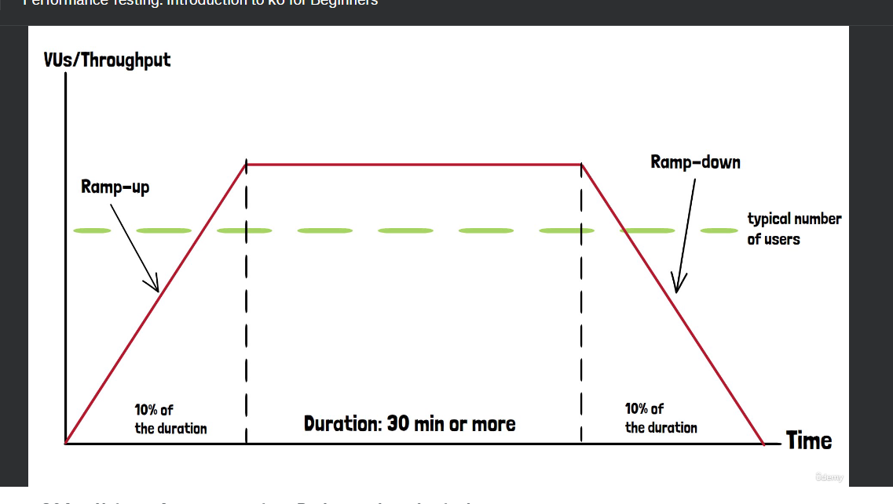
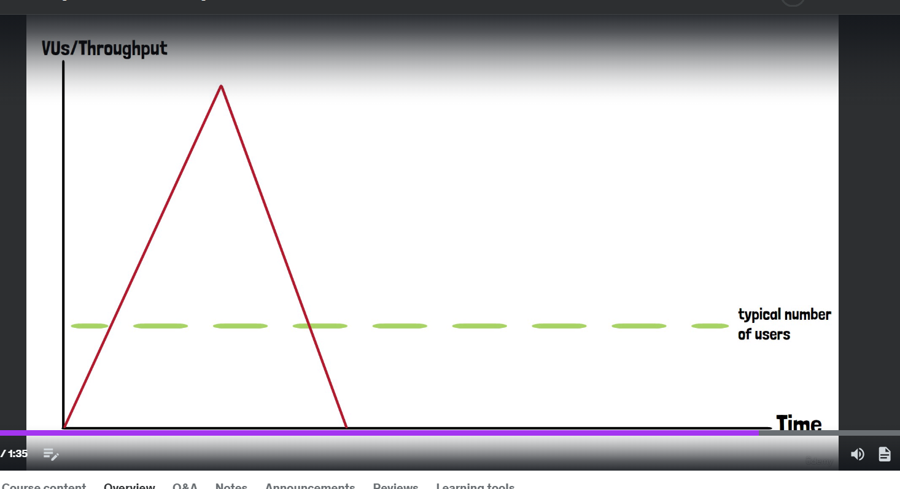
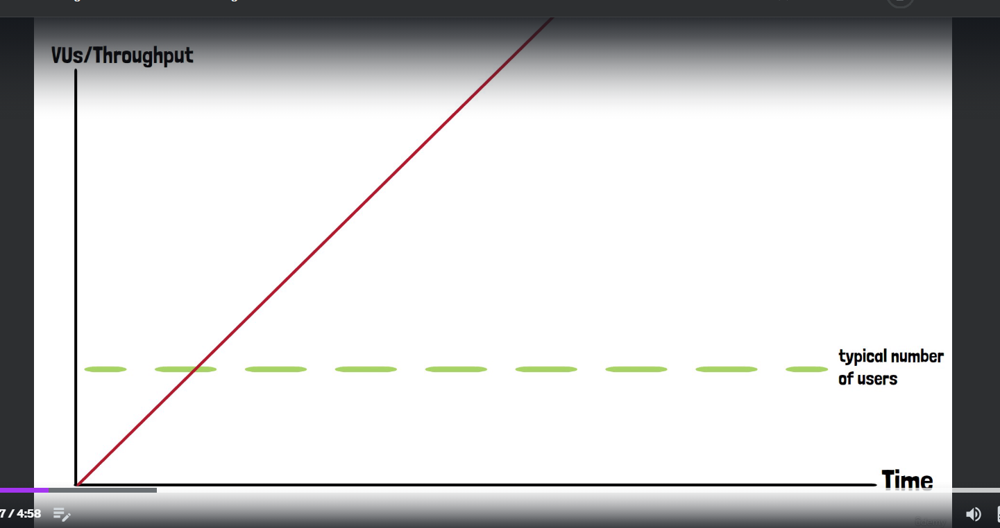
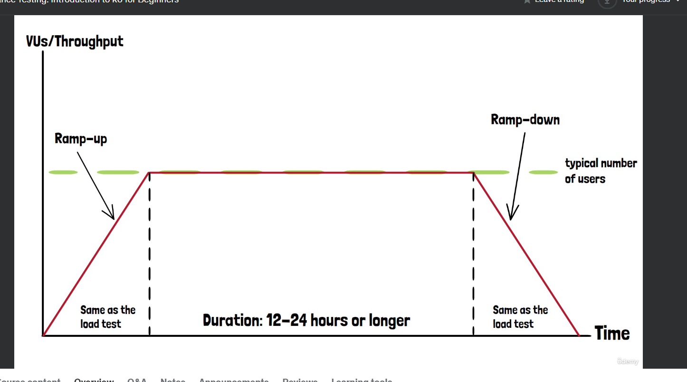

# performance testing

types of test we may run under performance testing

- load test:
- Stress test:
- spike test

# scaling : concepts

- vertical scaling
- horizontal scaling

# smoke testing

sets of tests that checks basic functionality of the application. no point in whole fledged application or with tests if basics not working

for smoke test, we are sending 1 vu per application and check its response. ALso helps setup base line

# smoke testing with k6:

we can refer website to get more test links(https://test.k6.io/)

and create a smoke script with 1 vu and 30 secs

```js
import http from 'k6/http';
import { sleep } from 'k6';

export const options = {
  vus: 1,
  duration: '30s',
};

export default function () {
  http.get('https://test.k6.io');
  sleep(1);
  http.get('https://test.k6.io/contacts.php');
  sleep(2);
  http.get('https://test.k6.io/news.php');
  sleep(2);
}
```

and to run command ==> k6 run .\smoke_test.js

we run smoke tests , to test our code and applicaiton to see if everything is working



# load testing:

we can testing application under typical load, typical load depends on the application.

it should based on emphirical data, eg our application handles typeically 300 concurrent users every moment during busiest hour of the day. that should be our baseline value for the load. if there's no emphirical data as probably applicaiton is not lauched in production yet. it is best to estimate number of expected users.

in load testing, we check how our application perform during sustained period of time under a typical load. As it doesnt make sense to run it few minutes, some issues tend to occur after a while. it is not uncommon to have load run for 30 mins or more. ALso users increase or decrease over time.
so we should also gradually increase the user and applicaiton need a bit of time to scale their resources and if we send lots of user all of a sudden
the autoscale capabilty of the application wont be kick in so fast.



typically in a load test, we have three stages

- ramp up stage: where we gradually increase nuber of users until reached the desired value.
- then stay longer for the desired (typical load)
- ramp down and decreasing number of users

ramp up time is typically 10% of total duration so if we running load for 30 mins then it should around 5 mins. selecting a lower value may not allow system to ramp up. this time period is important as this might show the first sign of weakness.

same goes for ramp down time, if we stop the test all of a sudden then we not actually selecting scaling down capabilities of the application
so we have similar values for the 10% of total durstion for ramp down

# load testing with k6

now we need to define ramp up and down period as well otherwise k6 will start with the vu count we provided to it under "options" like below

```js
export const options = {
  vus: 100,
  duration: '30m',
};
```

for this we will use stages, instead of "vus" we use "target" in "stages"

```js
import http from 'k6/http';
import { sleep } from 'k6';

export const options = {
  stages: [
    //in 5 mins k6 will react 100 users
    {
      duration: '5m',
      target: 100,
    },
    //stayed here for 30 mins for target user of 100 users
    {
      duration: '30m',
      target: 100,
    },
    // then we ramping down to 0 in 5 mins
    {
      duration: '5m',
      target: 0,
    },
  ],
};

export default function () {
  http.get('https://test.k6.io');
  sleep(1);
  http.get('https://test.k6.io/contacts.php');
  sleep(2);
  http.get('https://test.k6.io/news.php');
  sleep(2);
}
```

but we will run it with smaller numbers

```js
import http from 'k6/http';
import { sleep } from 'k6';

export const options = {
  stages: [
    {
      duration: '10s',
      target: 10,
    },
    {
      duration: '30s',
      target: 10,
    },
    {
      duration: '10s',
      target: 0,
    },
  ],
};

export default function () {
  http.get('https://test.k6.io');
  sleep(1);
  http.get('https://test.k6.io/contacts.php');
  sleep(2);
  http.get('https://test.k6.io/news.php');
  sleep(2);
}
```

result:



# stress testing :

once we are done with load test and found our applivation is working fine within permissible limits , we may want to understand how our applicaito will peform in above normal conditions. type of testing that put higher than average load in our application is called stress testing

eg like period around black friday when application should be able to handle much more users, then any other period of the year

aditional load can be 20% more or 100% more , really depends on the application. again we can use emphirical data say for last year and try to guess what would be this year



application might perform great or we might observe degraded performance

# stress testing with k6:

if no data, keep increasing load by 10% instead of drastically increasing to 20% or 50%

keep in mind, we run stress test only after load tests and aim of stress test is to test application under above average conditions.

# spike testing:

our application might need to handle expected or unexpected events that leads to sudden spike in number of users.

say application is handling typical number of users, then all of sudden application need to handle sudden spike, that goes above the limit set for stress testing so in this case , ramp up time is practically inexistent so way we need to define this scenario is bit different what we did before
many users will hit application and dont stick around very much, so some part of application will get more load



# spike testing with k6

we have mutiple stages like this with up and dows. a users typically wont go over all the pages may be they got news about the website and they opened it and then closed it

here both ramp up and ramp down stages are very steep

```js
import http from 'k6/http';
import { sleep } from 'k6';

export const options = {
  // to given usres in 2minute
  stages: [
    {
      duration: '2m',
      target: 10000,
    },
    //ramp down to 0 in 1 minute
    {
      duration: '1m',
      target: 0,
    },
  ],
};

export default function () {
  http.get('https://test.k6.io');
  sleep(1);
}
```

to get numbers, we can use stress test and make it 4 times or even more. and because load is high and very sudden , it can result in crash and then need to observe, can it recover after crash on its own and we need to manually fix it.

# breakpoint testing

by which we can determine max capacity of the application, this test gradully increases the load from 0 upto very high value. idea is to find the point where application start breaking

load needs to increae similar to load/stress test and this test has only one stage that is scale up to infinity



we have only one state

we defined the time here in stage, but we need to keep in mind that such test dont have pre-defined end , we need to closly monitor the applicaiton and notice the point when error rate is very high or response time is unacceptable or application completely stopped responding as it crashed

then you manually need to stop the test and write down the number of users its able to handle

```js
import http from 'k6/http';
import { sleep } from 'k6';

export const options = {
  stages: [
    {
      duration: '2h',
      target: 10000,
    },
  ],
};

export default function () {
  http.get('https://test.k6.io');
  sleep(1);
}
```

it makes sense to run breakpoint test after sucessful completion of load and stress tests

# soak testing

soak test or endurance test , we take load test and simply stress its duration



we dont touch the ramp up and ramp down, only will increase the middle stage time, to see how it behave for constant load for a long time

what issues it can find which load tesitng cannot found is :

- memory leak can occur ,
- disk space issue(db entry or log entries, cache)
- any other issue that can occur during extended period

this should only be considered after completion of load test
