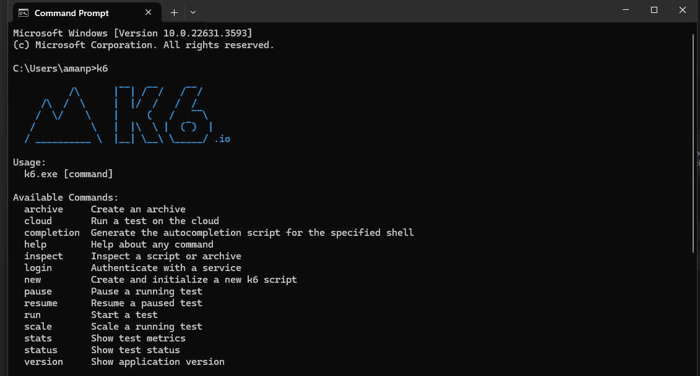
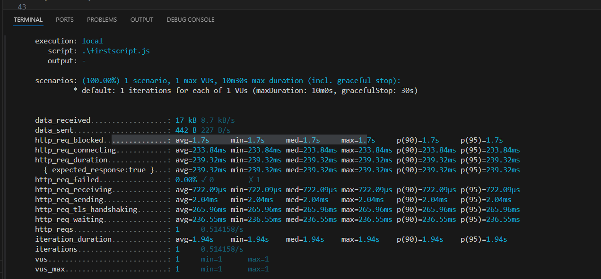
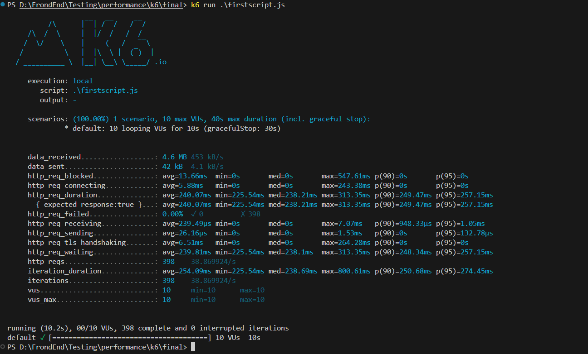
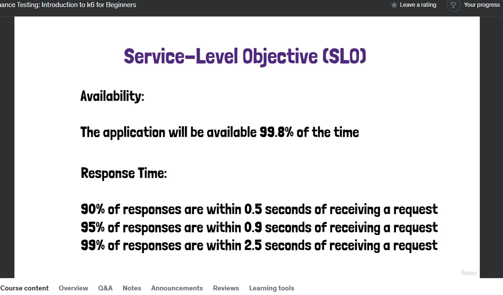

# install k6

https://grafana.com/docs/k6/latest/set-up/install-k6/

and then check in cmd(as it has not GUI)

> k6



# to run the script

add "firstscript.js" file, this will simulate one request and 1 user

```ts
import http from 'k6/http';

export default function () {
  http.get('https://test.k6.io');
}
```

then to run this script open terminal and use command:

> k6 run firstscript.js

# basic concepts

-virtual users (VU)

- requests per sec

- latency: like waiting time between making a request and getting it. less is better. like time between ordering a pizza and getting delivered

- throughput: shows the number of requests a website can handle in a specific amount of time.it means high throughput, it can serve many users or requests quickly, low throughput means it might struggle when many users visit website at a same time

-iterations : repeat actions ie login

# virtual users and duration

> by default , k6 creates 1 VU and runs for 1 sec



> but now to do some real load tests, now to pass the configs/details, we use "options"

```js
import http from 'k6/http';

export const options = {
  vus: 10, //10 virtual user
  duration: '10s', //duration
};

export default function () {
  http.get('https://test.k6.io');
}
```

in the results, we see iterations, http_req

if there are difference in "iterations" and "https_req" it means there are some redirects happening



> to mimic real user, we can add wait using "sleep"

```js
import http from 'k6/http';
import { sleep } from 'k6';

export const options = {
  vus: 10,
  duration: '10s',
};

export default function () {
  http.get('https://test.k6.io');
  sleep(1);
}
```

# understanding test results and metrics:

we have metrics like , avg, min, max , median, p(90) and p(95)

p(90) means 90% of the requests were equal or faster than given latency ie (p(90)=402.3ms for http_req_duration) means 90% of requests are faster than 402.ms

similarly we have p(95) and p(99) (p(99) is not visible in this report)

why we not consider just "avg" and looks for other params like above(p90,p95,p99), as "avg" doesnt give us full picture , say out of 500 people, 400 people got a product in "20" seconds but rest 100 got a product in "500" seconds but if we look at the average it would come out as "2" minutes which doesnt give full picture. Also if we think about it , nobody got product in 2 mins.

thats why we need to know how many people wait a little, how many people waited a lot, thats where percentiles comes handy.

> Good latency

- all requests to be below 300ms

we usually work with SLO(service level objective) like availablity , applicaiton will be available 99.8% of time, similary we can have for responses times



k6 wont provide cpu and memory usage in report, as obvious its not aware of it.
